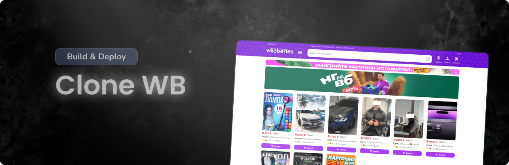

   
    
   
   
   
   

  

    
    
  

 
  <h3 align="center">Clone WB</h3>

   

     Это клонированная версия популярного интернет-магазина Wildberries, созданная с целью изучения и применения различных концепций и технологий, связанных с разработкой пользовательских интерфейсов на React.
    

## 📋 <a name="table">Tech Stack</a>

1. 🌐 React
2. 🛣️ React Router DOM
3. 🎨 Material-UI (MUI)
4. 📡 Axios
5. 🖥️ JSON Server
6. 🔐 JSON Server Auth
7. 🚀 Swiper
8. 🎨 Sass
9. 🧩 Concurrently

##

> ⚠️ **Важно:** Оригинальный логотип защищён авторским правом.  
> Вместо него используется следующий логотип:  
> 
